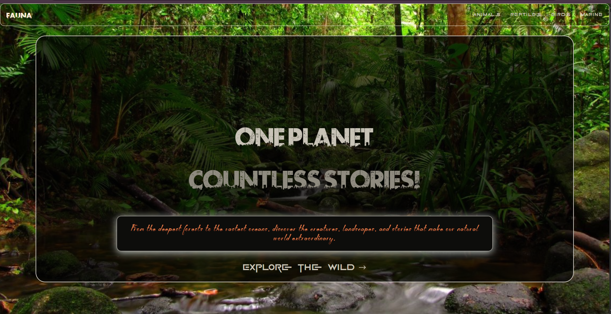
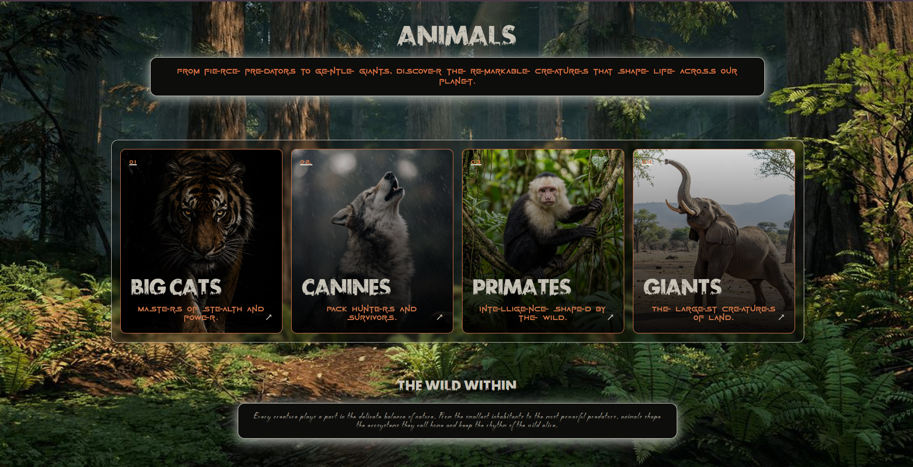
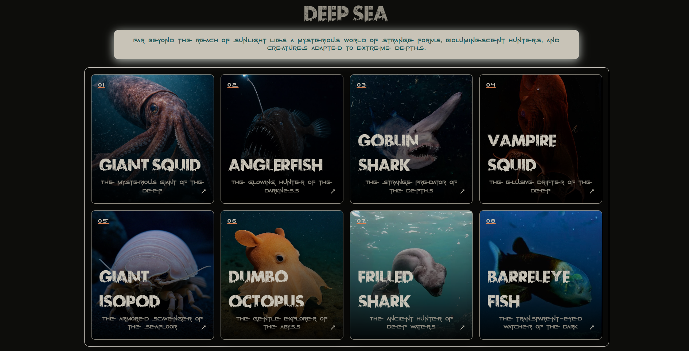

# 🌿 FAUNA

### One Planet. Countless Stories.

An immersive digital journey through the wild — exploring animals, reptiles, birds, and marine life through an interactive visual experience.

[🌐 Live Demo](https://pranab0104.github.io/Fauna/) · [💻 GitHub Repository](https://github.com/Pranab0104/Fauna)

---

## 🌍 Overview

FAUNA is an immersive wildlife exploration website created to bring the diversity of the natural world into an interactive digital experience.

The website allows users to explore different wildlife categories and discover individual creatures through dedicated dynamic detail pages.

From powerful predators and ancient reptiles to birds of the sky and creatures of the deep sea, FAUNA presents wildlife through a visual and interactive interface.

---

## ✨ Features

- 🌍 Explore Animals, Reptiles, Birds, and Marine Life
- 🐾 16 wildlife subcategories
- 🦁 128 individual creature profiles
- 🔗 Dynamic routing with React Router
- 📄 Reusable dynamic creature detail pages
- 🖼️ Immersive image-based visual design
- ✨ Interactive cards and hover effects
- 🧭 Category-based navigation
- 📱 Responsive design across devices
- 🚀 Deployed using GitHub Pages

---

## 📸 Screenshots

### Home

### Animals

### Creature Details

---

## 🛠️ Tech Stack

- React.js
- JavaScript
- React Router
- Tailwind CSS
- CSS
- Vite
- GitHub Pages

---

## 📂 Project Structure

src/
├── components/
├── pages/
├── data/
├── App.jsx
├── main.jsx
└── index.css

public/
└── images/

screenshots/
├── home.png
├── animals.png
└── creature.png

⚙️ Installation & Setup
Clone the repository:

git clone https://github.com/Pranab0104/Fauna.git
Navigate into the project:
cd Fauna
Install dependencies:
npm install
Start the development server:
npm run dev

📱 Responsive Design
FAUNA is designed to adapt across:

- Desktop
- Laptop
- Tablet
- Mobile

Future Improvements:

Search and filtering
More species
Advanced animations
Wildlife conservation information
Dark/light visual variations
Accessibility improvements

👨‍💻 Author

Pranav Mandal
Frontend Developer
GitHub: https://github.com/Pranab0104
